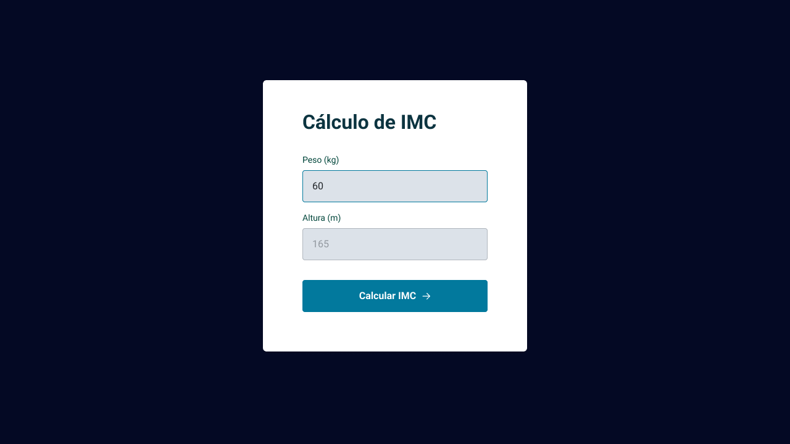
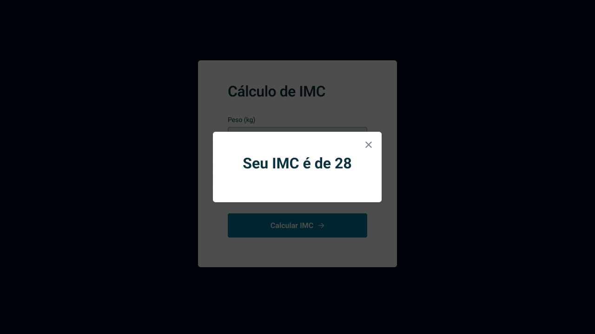
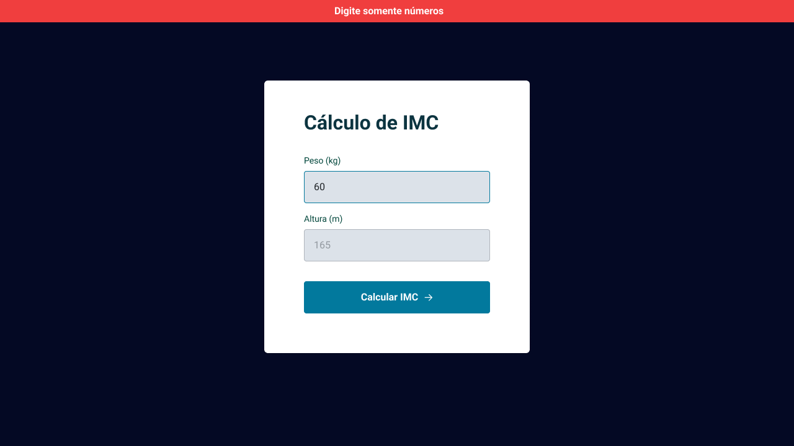

<h1 align="center"> Projeto - Cálculadora de IMC  </h1>

Hora de colocar em prática o que foi ensinado na primeira fase do stage 05 e o que foi visto nos stages anteriores.

  <a href="#-tecnologias">Tecnologias</a>&nbsp;&nbsp;&nbsp;|&nbsp;&nbsp;&nbsp;
  <a href="#-projeto">Projeto</a>&nbsp;&nbsp;&nbsp;|&nbsp;&nbsp;&nbsp;
  <a href="#-layout">Layout</a>&nbsp;&nbsp;&nbsp;|&nbsp;&nbsp;&nbsp;
  <a href="#memo-licença">Licença</a>

  

 

## 🚀 Tecnologias

Esse projeto foi desenvolvido com as seguintes tecnologias:

&nbsp;
&nbsp;
&nbsp;

## 💻 Projeto

Cálculadora IMC, projeto que o paciente coloca seu peso e altura para calcular o seu IMC.

## 🔖 Layout do projeto

 
 

 
 

 
 

Link do Figma: 
 
https://www.figma.com/file/naoEqR0GsL9wDcvPRRlrMl/IMC-(Copy)?type=design&node-id=108-2&mode=design&t=BY22isrbIJ3HABJU-0
 

## Aprendizado

- Estrutura de dados HTML;
- Animações com CSS;
- Funções no Javascript;
- Manipulação da DOM;
- Biblioteca JS Math();
- Funções *callback*;
- Arrays;

 

Feito com ♥ by Anny Mello 